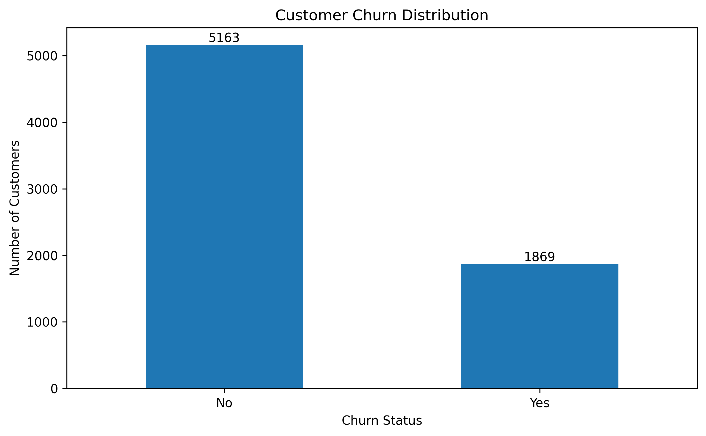
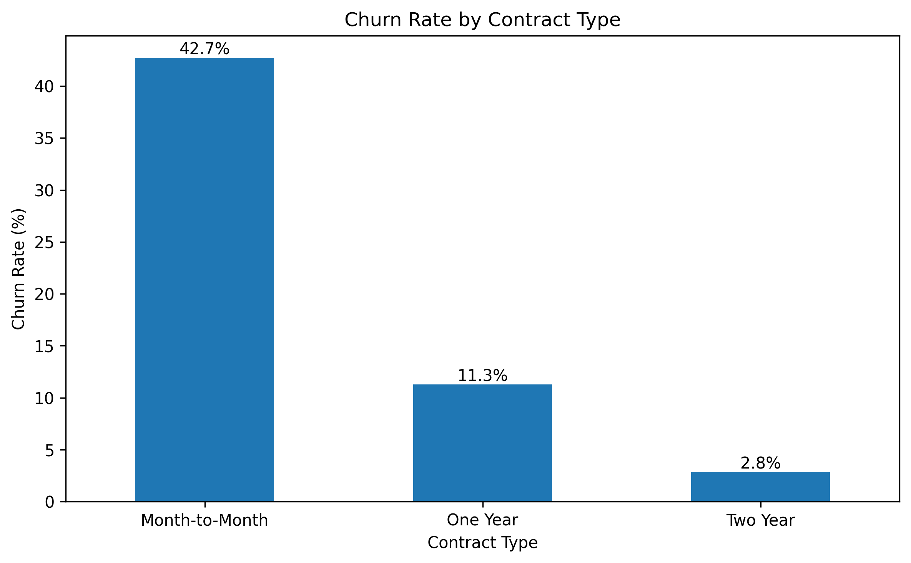
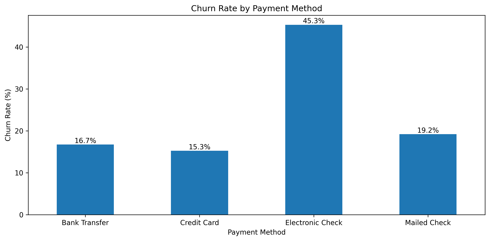
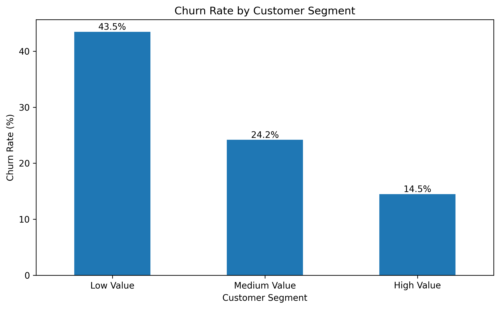
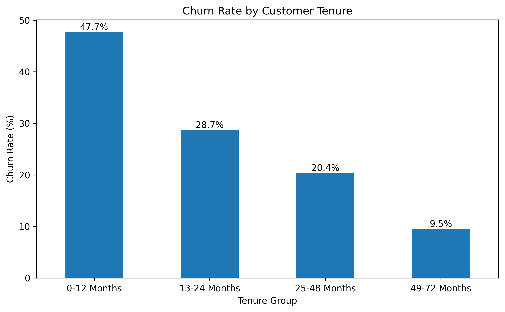

# Customer Churn & Customer Value Analysis

## Project Overview

This project analyzes customer churn behavior using a telecommunications customer dataset. The objective is to identify key factors associated with customer attrition and provide actionable recommendations to improve customer retention and business performance.

---

## Tools & Technologies

- Python
- Pandas
- NumPy
- Matplotlib
- Google Colab

---

## Dataset

**Dataset:** Telco Customer Churn Dataset

**Records:** 7,032 customers

**Key Features:**
- Customer demographics
- Contract type
- Payment method
- Monthly charges
- Total charges
- Customer tenure
- Churn status

---

## Project Workflow

1. Data Cleaning & Preprocessing
2. Exploratory Data Analysis (EDA)
3. Contract Type Analysis
4. Payment Method Analysis
5. Customer Value Segmentation
6. Customer Lifecycle Analysis
7. Business Recommendations

---

## Key Findings

### 1. Overall Customer Churn

The overall customer churn rate reached **26.6%**, indicating that customer retention is a significant business challenge.



---

### 2. Contract Type Analysis

Customers with **Month-to-Month contracts** exhibited the highest churn rate (**42.7%**), while customers under longer-term contracts showed significantly stronger retention.



**Insight:**
- Long-term contracts improve customer retention.
- Businesses should encourage customers to migrate from monthly plans to annual contracts.

---

### 3. Payment Method Analysis

Customers using **Electronic Check** showed the highest churn rate (**45.3%**).



**Insight:**
- Payment behavior is strongly associated with customer retention.
- Promoting automatic payment methods may reduce churn risk.

---

### 4. Customer Value Segmentation

Customers were segmented into:

- High Value
- Medium Value
- Low Value

based on Total Charges.



**Insight:**
- Low-value customers experienced the highest churn rate (**43.5%**).
- High-value customers demonstrated significantly stronger retention.

---

### 5. Customer Lifecycle Analysis

Customer tenure showed a strong relationship with churn behavior.



**Insight:**
- Customers who churned had an average tenure of **17.98 months**.
- Retained customers had an average tenure of **37.65 months**.
- Churn is concentrated among newly acquired customers.

---

## Business Recommendations

### Recommendation 1
Encourage Month-to-Month customers to adopt long-term contracts.

### Recommendation 2
Promote automatic payment methods to improve customer retention.

### Recommendation 3
Develop targeted retention campaigns for low-value customers.

### Recommendation 4
Strengthen onboarding and engagement strategies for newly acquired customers.

---

## Project Structure

```text
Customer-Churn-Analysis
│
├── Customer_Churn_Analysis.ipynb
├── churn_distribution.png
├── contract_churn.png
├── payment_churn.png
├── segment_churn.png
├── tenure_churn.png
└── README.md
```

---

## Author

Independent Data Analytics Project

Created using Python, Pandas, Matplotlib, and Google Colab.
